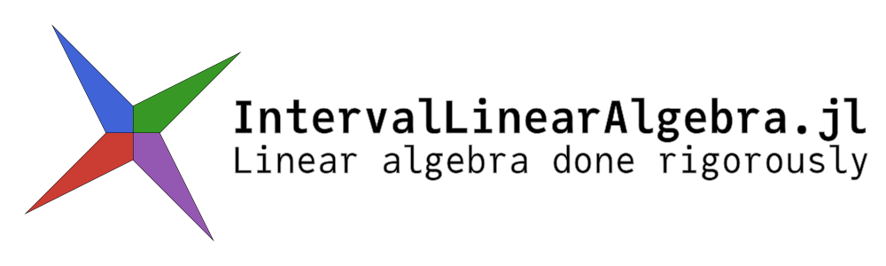
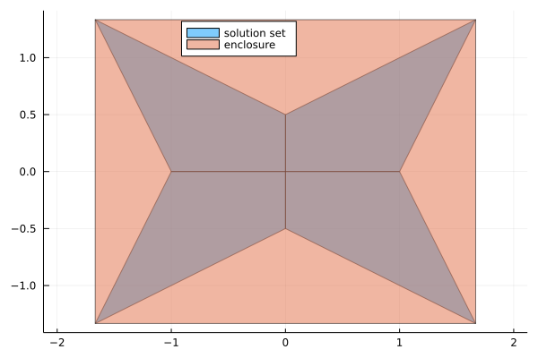

| **Pkg Info** | **Build status** | **Documentation** | **Citation** | **Contributing** |
|:------------:|:----------------:|:-----------------:|:------------:|:----------------:|
|![version][ver-img][![license: MIT][mit-img]](LICENSE)|[![CI][ci-img]][ci-url][![codecov][cov-img]][cov-url]|[![docs-stable][stable-img]][stable-url][![docs-dev][dev-img]][dev-url]|[![bibtex][bib-img]][bib-url][![zenodo][doi-img]][doi-url]| [![contributions guidelines][contrib-img]][contrib-url]|


## Overview

This package contains routines to perform numerical linear algebra using interval arithmetic. This can be used both for rigorous computations and uncertainty propagation.

If you use this package in your work, please cite it as

```
@software{ferranti2021interval,
author = {
            Luca Feranti and
            Marcelo Forets and
            David P. Sanders
         },
title  = {IntervalLinearAlgebra.jl: linear algebra done rigorously},
month  = {9},
year   = {2021},
doi    = {10.5281/zenodo.5363563},
url    = {https://github.com/juliaintervals/IntervalLinearAlgebra.jl}
}
```

## Features

**Note**: The package is still under active development and things evolve quickly (or at least should)

- enclosure of the solution of interval linear systems
- exact characterization of the solution set of interval linear systems using Oettli-Präger
- verified solution of floating point linear systems
- enclosure of eigenvalues of interval matrices
- verified computation of eigenvalues and eigenvectors of floating point matrices

## Installation

Open a Julia session and enter

```julia
using Pkg; Pkg.add("IntervalLinearAlgebra")
```

this will download the package and all the necessary dependencies for you. Next you can import the package with

```julia
using IntervalLinearAlgebra
```

and you are ready to go.

## Documentation
- [**STABLE**][stable-url] -- Documentation of the latest release
- [**DEV**][dev-url] -- Documentation of the current version on main (work in progress)

The package was also presented at JuliaCon 2021! The video is available [here](https://youtu.be/fre0TKgLJwg) and the slides [here](https://github.com/lucaferranti/ILAjuliacon2021)

[](https://youtu.be/fre0TKgLJwg)

## Quickstart

Here is a quick demo about solving an interval linear system.

```julia
using IntervalLinearAlgebra, LazySets, Plots

A = [2..4 -1..1;-1..1 2..4]
b = [-2..2, -1..1]

Xenclose = solve(A, b)
polytopes = solve(A, b, LinearOettliPrager())

plot(UnionSetArray(polytopes), ratio=1, label="solution set", legend=:top)
plot!(IntervalBox(Xenclose), label="enclosure")
```
<p align="center">
    
</p>

## Contributing

If you spot something strange in the software (something doesn't work or doesn't behave as expected) do not hesitate to open a [bug issue](https://github.com/JuliaIntervals/IntervalLinearAlgebra.jl/issues/new?assignees=&labels=bug&template=bug_report.md&title=%5BBUG%5D).

If have an idea of how to make the package better (a new feature, a new piece of documentation, an idea to improve some existing feature), you can open an [enhancement issue](https://github.com/JuliaIntervals/IntervalLinearAlgebra.jl/issues/new?assignees=&labels=enhancement&template=feature_request.md&title=%5Bfeature+request%5D%3A+). 

If you feel like your issue does not fit any of the above mentioned templates (e.g. you just want to ask something), you can also open a [blank issue](https://github.com/JuliaIntervals/IntervalLinearAlgebra.jl/issues/new).

Pull requests are also very welcome! More details in the [contributing guidelines](https://juliaintervals.github.io/IntervalLinearAlgebra.jl/stable/CONTRIBUTING/)

The core developers of the package can be found in the `#intervals` channel in the Julia slack or zulip, links to join the platforms can be found [here](https://julialang.org/community/). Come to chat with us!

## References

An excellent introduction to interval linear algebra is
J. Horácek, _Interval Linear and Nonlinear Systems_, 2019, available [here](https://kam.mff.cuni.cz/~horacek/source/horacek_phdthesis.pdf)

See also the complete list of [references](https://juliaintervals.github.io/IntervalLinearAlgebra.jl/dev/references) for the concepts and algorithms used in this package.

## Related packages

- [IntervalArithmetic.jl](https://github.com/juliaintervals/IntervalArithmetic.jl) -- Interval computations in Julia
- [IntervalMatrices.jl](https://github.com/JuliaReach/IntervalMatrices.jl) -- Matrices with interval coefficients in Julia.

## Acknowledgment

The development of this package started during the Google Summer of Code (GSoC) 2021 program for the Julia organisation. The author wishes to thank his mentors [David Sanders](https://github.com/dpsanders) and [Marcelo Forets](https://github.com/mforets) for the constant guidance and feedback. During the GSoC program, this project was financially supported by Google.

[ver-img]: https://img.shields.io/github/v/release/juliaintervals/IntervalLinearAlgebra.jl

[mit-img]: https://img.shields.io/badge/license-MIT-yellow.svg

[ci-img]: https://github.com/juliaintervals/IntervalLinearAlgebra.jl/workflows/CI/badge.svg
[ci-url]: https://github.com/juliaintervals/IntervalLinearAlgebra.jl/actions

[cov-img]: https://codecov.io/gh/juliaintervals/IntervalLinearAlgebra.jl/branch/main/graph/badge.svg?token=mgCzKMPiwK
[cov-url]: https://codecov.io/gh/juliaintervals/IntervalLinearAlgebra.jl

[stable-img]: https://img.shields.io/badge/docs-stable-blue.svg
[stable-url]: https://juliaintervals.github.io/IntervalLinearAlgebra.jl/stable

[dev-img]: https://img.shields.io/badge/docs-dev-blue.svg
[dev-url]: https://juliaintervals.github.io/IntervalLinearAlgebra.jl/dev

[bib-img]: https://img.shields.io/badge/bibtex-citation-green
[bib-url]: ./CITATION.bib

[doi-img]: https://img.shields.io/badge/zenodo-DOI-blue
[doi-url]: https://doi.org/10.5281/zenodo.5363563

[contrib-img]: https://img.shields.io/badge/contributing-guidelines-orange
[contrib-url]: https://juliaintervals.github.io/IntervalLinearAlgebra.jl/stable/CONTRIBUTING/

[style-img]: https://img.shields.io/badge/code%20style-blue-4495d1.svg
[style-url]: https://github.com/invenia/BlueStyle
