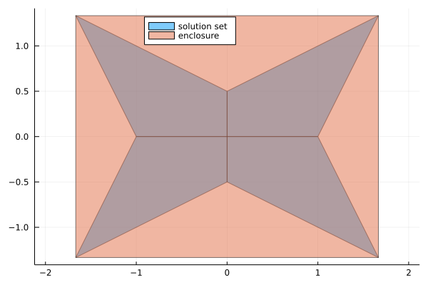

[](https://github.com/lucaferranti/IntervalLinearAlgebra.jl/blob/main/LICENSE)[](https://github.com/juliaintervals/IntervalLinearAlgebra.jl/actions)[](https://codecov.io/gh/juliaintervals/IntervalLinearAlgebra.jl)

## Overview

Documentation for [IntervalLinearAlgebra.jl](https://github.com/lucaferranti/IntervalLinearAlgebra.jl), a package for numerical linear algebra using interval arithmetic.

## Features

!!! note 
    The package is still under active development and everything can change overnight.

- Different algorithms to enclose the solution of an interval linear system
- classify interval matrices
- rigorous solution of real linear systems
- exact characterization of the solution of interval linear systems using Oettli-Präger

## Installation

The package is not registered yet, it can be installed as

```julia
(@v1.6) pkg> add https://github.com/lucaferranti/intervallinearalgebra.jl
```

## Quickstart

```julia
using IntervalLinearAlgebra, LazySets, Plots

A = [2..4 -1..1;-1..1 2..4]
b = [-2..2, -1..1]

Xenclose = solve(A, b)
polytopes = solve(A, b, LinearOettliPrager())

plot(UnionSetArray(polytopes), ratio=1, label="solution set", legend=:top)
plot!(IntervalBox(Xenclose), label="enclosure")
```


